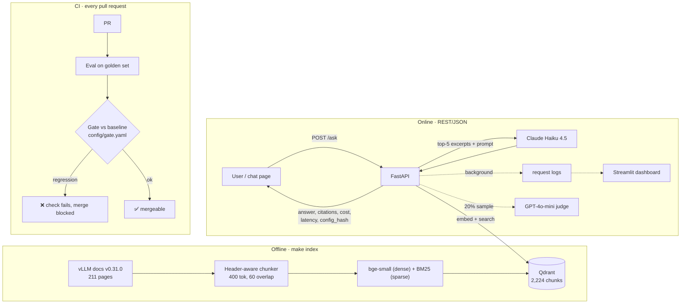

# vLLM Docs RAG: question answering with an evaluation gate in CI

A question-answering service over the [vLLM](https://github.com/vllm-project/vllm) v0.31.0 documentation.
Every pull request is evaluated against a hand-written golden set, and **a PR that lowers answer
quality is blocked from merging**.

> Problem: RAG systems are usually built once and never measured again, so quality drops quietly
> whenever the prompt, chunking or model changes. Here every change is measured before it ships.

## Results

| Metric | Value |
|---|---|
| Golden set | _60 hand-written questions (in progress; CI currently runs the 6-question smoke set)_ |
| Recall@5 / MRR@10 | _fill in from `eval/baseline.json`_ |
| Faithfulness / Correctness (LLM judge) | _fill in_ |
| Refusal accuracy on unanswerable questions | _fill in_ |
| Latency p50 / p99 (end to end) | _fill in from the dashboard_ |
| Retrieval latency (warm) | ~4–50 ms |
| Cost per query (Claude Haiku 4.5) | _≈ $0.005, fill in measured_ |
| Load test throughput | _fill in from `make loadtest`_ |

## Architecture



**Request path:** embed the question (same model as the index; the service refuses to start on a mismatch) →
top-20 dense search (optionally fused with BM25 by Reciprocal Rank Fusion) → refuse if nothing relevant →
top-5 excerpts wrapped in `[BEGIN DOCUMENT n]` delimiters → Claude Haiku answers with `[n]` citations →
citations checked against the retrieved set. If the LLM fails, the service returns the relevant doc sections instead of an error.

## Evaluation

| Layer | Metrics | How | When |
|---|---|---|---|
| Retrieval | Recall@1/5/10, MRR@10, Section@5, per slice | Programmatic, against `source_docs` | Every PR (free) |
| Generation | Faithfulness, correctness, citation validity | GPT-4o-mini judge (a different model family from the generator) | Every PR when keys are set |
| Refusals | Refusal accuracy, false-refusal rate | Programmatic, on the `unanswerable` slice | Every PR |
| Online | Thumbs up/down, sampled faithfulness | `/feedback`, background judge on 20% of traffic | Live |

Gate rules (`config/gate.yaml`): a metric fails if it drops more than its tolerance from the target
branch's baseline **or** falls below an absolute floor. Retrieval tolerances are tight because those
metrics are deterministic; judge tolerances are wider because judge scores are noisy.

## Versioning

- All tunables are in `config/rag.yaml`; prompts are in `prompts/*.txt`.
- `config_hash` (config + prompt text) is returned with every answer and recorded in every log row and eval run.
- `index_hash` (corpus + chunking + embedding model + chunking code) names the Qdrant collection, so a
  chunking change builds a new index instead of mixing vector versions.

## Run it

```bash
make setup                 # virtualenv + dependencies
cp .env.example .env       # add ANTHROPIC_API_KEY and OPENAI_API_KEY
make index                 # ~2 min on a laptop CPU
make eval-retrieval        # free retrieval eval
make eval                  # full eval with the LLM judge
make serve                 # API + chat page on http://localhost:8000
make dashboard             # monitoring on http://localhost:8501
make test                  # unit tests
```

## Stack and why

| Choice | Over | Because |
|---|---|---|
| Qdrant (embedded locally/CI, Cloud optional) | Chroma, pgvector | Payload filtering, dense + sparse vectors in one collection, and the same client with no server in CI |
| bge-small via fastembed (local CPU) | API embeddings | Free, deterministic in CI, no vendor lock-in |
| Claude Haiku 4.5 generator, GPT-4o-mini judge | One model for both | A judge from a different family avoids grading its own answers |
| Chunk size 400 tokens | 512 | bge-small truncates at 512 tokens, and every chunk carries a page/section breadcrumb |
| Hosted LLM API | Self-hosted vLLM on a GPU | At ~1k queries/day the API costs a few dollars, a GPU costs hundreds a month |

## Repository layout

```
config/       rag.yaml (all tunables), gate.yaml (CI rules)
prompts/      versioned system prompts
data/         vLLM v0.31.0 docs snapshot (Apache-2.0, see data/SOURCE.md)
src/rag/      chunking, index, retrieve, pipeline, api, telemetry
src/rag/evaluation/  dataset, metrics, judge, run, compare (the gate), sweep (experiments)
eval/         golden.csv, smoke.csv, baseline.json, doc_map.md
dashboard/    Streamlit monitoring app
loadtest/     Locust load test
```
