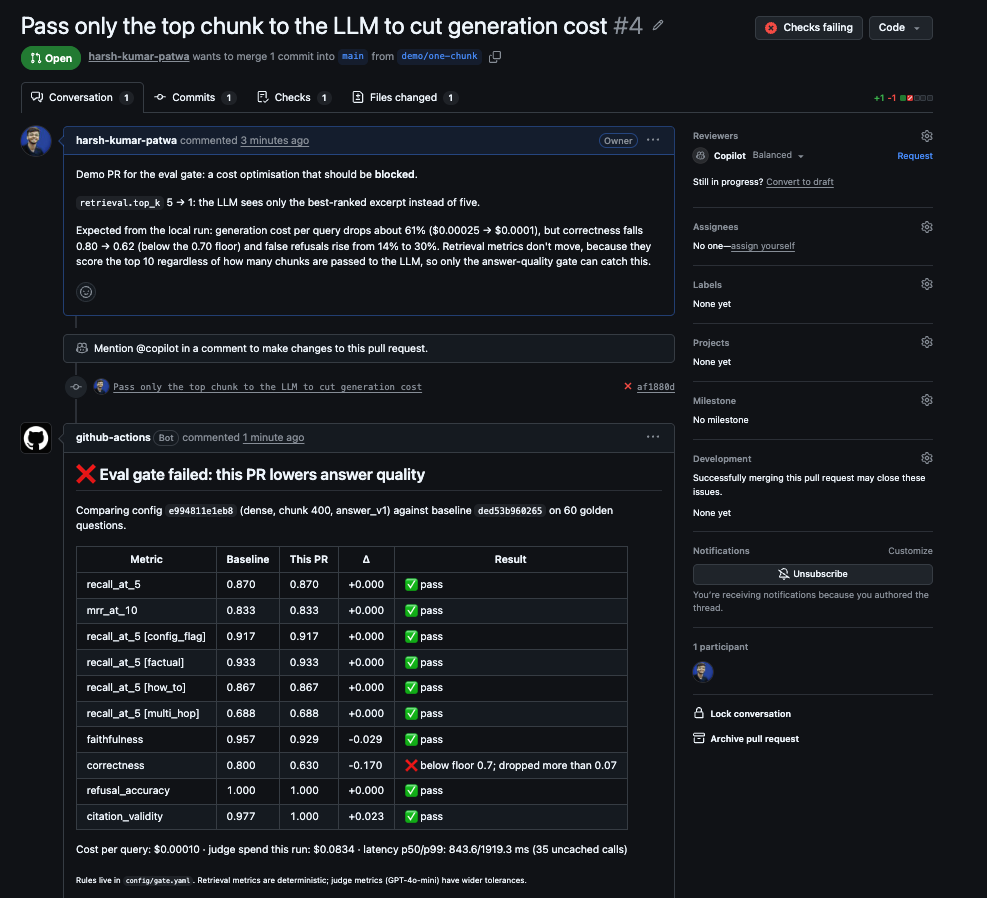
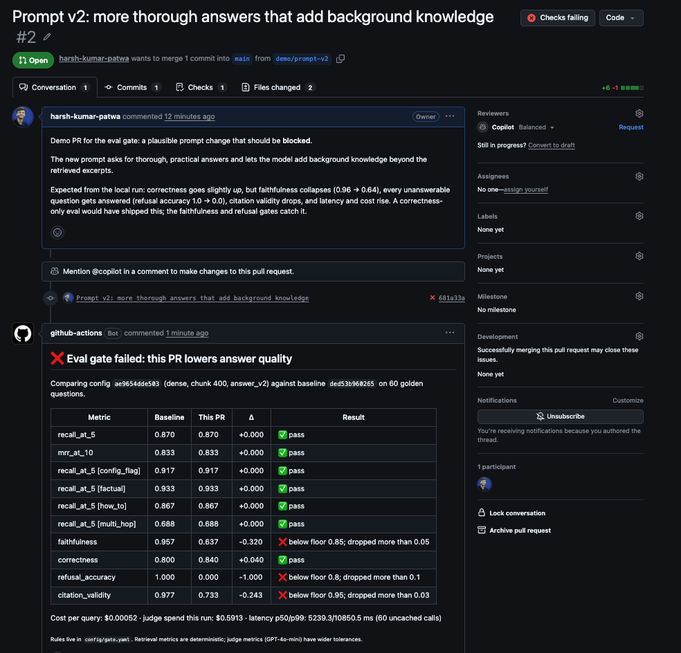
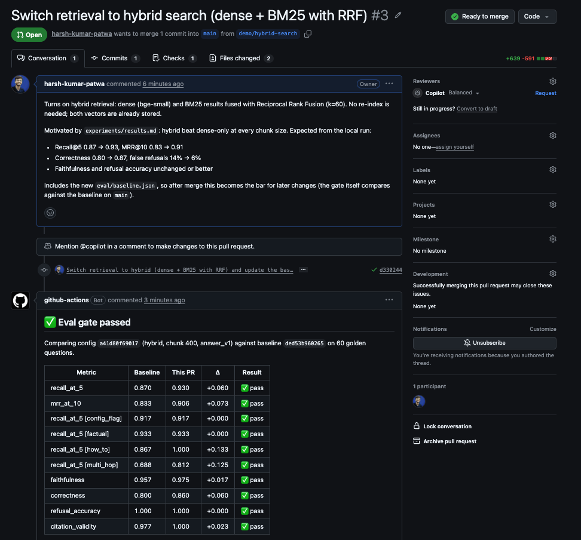
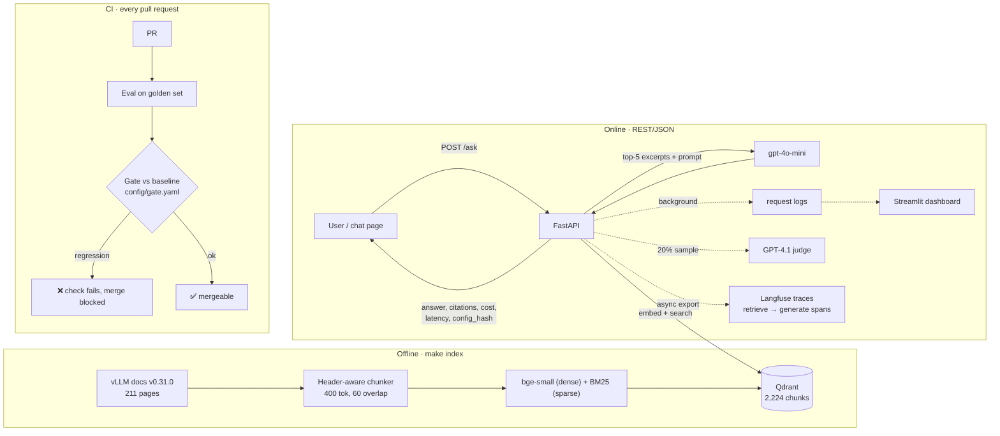

# vLLM Docs RAG: question answering with an evaluation gate in CI

A question-answering service over the [vLLM](https://github.com/vllm-project/vllm) v0.31.0 documentation.
Every pull request is evaluated against a hand-written golden set, and **a PR that lowers answer
quality is blocked from merging**.

**Live demo:** https://huggingface.co/spaces/harsh-personal/vllm-docs-rag
(API: `https://harsh-personal-vllm-docs-rag.hf.space`, e.g. `GET /health`, `POST /ask`). The Space sleeps when idle,
so the first request after a pause can take about a minute.

> Problem: RAG systems are usually built once and never measured again, so quality drops quietly
> whenever the prompt, chunking or model changes. Here every change is measured before it ships.

## Results

Current baseline on `main` (hybrid retrieval, chunk 400, prompt `answer_v1`, gpt-4o-mini, judged by GPT-4.1):

| Metric | Value |
|---|---|
| Golden set | 60 questions: 15 factual, 15 how-to, 12 config-flag, 8 multi-hop, 10 unanswerable (`eval/golden.csv`) |
| Recall@5 / MRR@10 | **0.930 / 0.906** (dense-only was 0.870 / 0.833) · multi-hop Recall@5 0.812 |
| Faithfulness / Correctness | **0.977 / 0.870** |
| Refusal accuracy (unanswerable) / false refusals (answerable) | **1.00 / 0.06** |
| Citation validity | 1.00 |
| Cost per query (generation) | **$0.00027** · a full 60-question eval incl. judge ≈ $0.22 |
| Latency, eval run (uncached LLM calls) | p50 1.33 s · p95 2.35 s · p99 2.74 s |
| Latency, live API (60 questions through `/ask`) | p50 1.21 s · p95 2.30 s · p99 2.98 s · 0% errors |
| Load test, retrieval path (`/search`, 1 process, laptop CPU) | **78 req/s at 100 users, 0 failures**, p50 6 ms, p99 38 ms |
| Judge calibration (20 answers vs an independent 2-agent Claude panel) | 80% agreement: judge flagged 3 faithful answers (strict), missed 1 unfaithful one (`eval/calibration_result.json`) |

The end-to-end path is bound by the LLM API (≈1.2 s and a provider rate limit per answer), not by retrieval:
the retrieval path was not saturated at 78 req/s.

## The eval gate in action

Three pull requests, each changing one thing, judged by the same 60 questions:

| PR | Change | What the gate saw | Result |
|---|---|---|---|
| [#4](https://github.com/harsh-kumar-patwa/sst-mlops-project/pull/4) | Pass only the top chunk to the LLM (`top_k` 5 → 1) to cut cost | Cost −61%, retrieval metrics unchanged, but **correctness 0.80 → 0.63** | ❌ blocked |
| [#2](https://github.com/harsh-kumar-patwa/sst-mlops-project/pull/2) | Prompt v2: "thorough answers, add your own knowledge" | Correctness *rose* to 0.84, but **faithfulness 0.96 → 0.64**, refusal accuracy 1.0 → 0.0, citations 0.98 → 0.73, p50 latency 5.2 s | ❌ blocked |
| [#3](https://github.com/harsh-kumar-patwa/sst-mlops-project/pull/3) | Hybrid retrieval (dense + BM25, RRF) | Recall@5 +0.06, multi-hop +0.125, correctness +0.06, faithfulness +0.02 | ✅ merged, new baseline |

Each regression was caught by a different metric: #4 is invisible to retrieval metrics, and #2 would pass a
correctness-only eval. That is why retrieval, correctness, faithfulness and refusals are gated separately.





## Architecture



**Request path:** embed the question (same model as the index; the service refuses to start on a mismatch) →
top-20 dense search and top-20 BM25 search fused by Reciprocal Rank Fusion → refuse if nothing relevant →
top-5 excerpts wrapped in `[BEGIN DOCUMENT n]` delimiters → gpt-4o-mini answers with `[n]` citations →
citations checked against the retrieved set. If the LLM fails, the service returns the relevant doc sections instead of an error.

## Evaluation

| Layer | Metrics | How | When |
|---|---|---|---|
| Retrieval | Recall@1/5/10, MRR@10, Section@5, per slice | Programmatic, against `source_docs` | Every PR (free) |
| Generation | Faithfulness, correctness, citation validity | GPT-4.1 judge (stronger than the generator; human-agreement calibrated) | Every PR when keys are set |
| Refusals | Refusal accuracy, false-refusal rate | Programmatic, on the `unanswerable` slice | Every PR |
| Online | Thumbs up/down, sampled faithfulness | `/feedback`, background judge on 20% of traffic | Live |

Gate rules (`config/gate.yaml`): a metric fails if it drops more than its tolerance from the target
branch's baseline **or** falls below an absolute floor. Retrieval tolerances are tight because those
metrics are deterministic; judge tolerances are wider because judge scores are noisy.

## Tracing (Langfuse)

Set `LANGFUSE_PUBLIC_KEY` / `LANGFUSE_SECRET_KEY` and every answer becomes a Langfuse trace:
`rag-answer` → `retrieve` (pages + scores) → `generate` (prompt, model, tokens, cost). Traces are tagged with
`config_hash`, prompt version and retrieval mode, so you can filter by version and compare before/after a change.
Scores attached to traces: `faithfulness` and `correctness` from eval runs (tagged `eval`), `faithfulness_online`
from the sampled live judge, and `user_feedback` from 👍/👎. The API's `request_id` is the trace id.
Export happens in a background thread, so tracing adds no request latency; without keys it is a no-op.

## Deployment

Hosted on [Hugging Face Spaces](https://huggingface.co/spaces/harsh-personal/vllm-docs-rag) (Docker, CPU upgrade at $0.03/hour with sleep when idle). `.github/workflows/deploy.yml` deploys **only after the eval gate has
passed on `main`**: it pushes the image sources to the Space, then polls the live `/health` until it reports the
same `config_hash` as the commit, so the deployed app is verified to match `main`.

- **Rollout:** every change reaches `main` through a PR that passed the gate, then deploys automatically.
  The deploy compares the app files with what the Space already runs and skips when nothing changed
  (README, tests, eval data), so the live app is not rebuilt and restarted for nothing.
- **Rollback:** revert the commit on `main`; the revert passes the gate and redeploys the previous version.
  `config_hash` in every response shows which version answered.
- **First deploy failed, and that is in the history:** the image build was OOM-killed while embedding
  (128 chunks per forward pass peaked above 3 GB). PR #7 embedded in batches of 4 (412 MB peak, identical retrieval
  scores), passed the gate, and the redeploy verified itself against `/health`.
- **Image:** the vector index and embedding models are built into the image (810 MB, ~340 MB RAM, starts in ~4 s),
  so no vector-database server is needed and an image tag pins code, config and index together.
- **Public-demo protection:** 10 questions/minute per visitor and 300/day in total (`ASK_LIMIT_PER_MINUTE`,
  `ASK_LIMIT_PER_DAY`), sampled online judging off (`ONLINE_JUDGE_RATE=0`), plus a hard spend limit on the OpenAI account.

## Judge calibration

The faithfulness judge (GPT-4.1) is checked against an independent labelling of 20 sampled answers
(`make calibrate`, labels in `eval/calibration.csv`). Labels are kept in separate columns:
`human_faithful` for people, `panel_faithful` for an AI panel of two Claude labellers with opposite
instructions (one hunting for unsupported claims, one looking for support), with an adjudicator for
disagreements. The panel is a cross-family check on the GPT judge, not a substitute for human labels.

Result (panel, 20 answers): **80% agreement**. The judge is stricter than the panel: it flagged 3 answers the
panel found fully supported (once on a sentence the excerpt states word for word), and missed 1 answer that
invents a condition. Cohen's kappa is not meaningful here because 19 of 20 answers are faithful, so the
disagreements are reported individually instead. Because the judge errs toward flagging, a faithfulness
drop in CI is more likely a false alarm than a missed regression, which is the safe direction for a merge gate.

## Versioning

- All tunables are in `config/rag.yaml`; prompts are in `prompts/*.txt`.
- `config_hash` (config + prompt text) is returned with every answer and recorded in every log row and eval run.
- `index_hash` (corpus + chunking + embedding model + chunking code) names the Qdrant collection, so a
  chunking change builds a new index instead of mixing vector versions.

## Run it

```bash
make setup                 # virtualenv + dependencies
cp .env.example .env       # add OPENAI_API_KEY (and optional Langfuse keys)
make index                 # ~2 min on a laptop CPU
make eval-retrieval        # free retrieval eval
make eval                  # full eval with the LLM judge
make serve                 # API + chat page on http://localhost:8000
make dashboard             # monitoring on http://localhost:8501
make test                  # unit tests
```

## Stack and why

| Choice | Over | Because |
|---|---|---|
| Qdrant (embedded locally/CI, Cloud optional) | Chroma, pgvector | Payload filtering, dense + sparse vectors in one collection, and the same client with no server in CI |
| bge-small via fastembed (local CPU) | API embeddings | Free, deterministic in CI, no vendor lock-in |
| gpt-4o-mini generator, GPT-4.1 judge (same provider) | Two providers | One API key and budget; the stronger judge plus a human-agreement check bounds the self-preference risk |
| Chunk size 400 tokens | 512 | bge-small truncates at 512 tokens, and every chunk carries a page/section breadcrumb |
| Hosted LLM API | Self-hosted vLLM on a GPU | At ~1k queries/day the API costs a few dollars, a GPU costs hundreds a month |

## Repository layout

```
config/       rag.yaml (all tunables), gate.yaml (CI rules)
prompts/      versioned system prompts
data/         vLLM v0.31.0 docs snapshot (Apache-2.0, see data/SOURCE.md)
src/rag/      chunking, index, retrieve, pipeline, api, telemetry
src/rag/evaluation/  dataset, metrics, judge, run, compare (the gate), sweep (experiments)
eval/         golden.csv, smoke.csv, baseline.json, doc_map.md
dashboard/    Streamlit monitoring app
loadtest/     Locust load test
```
